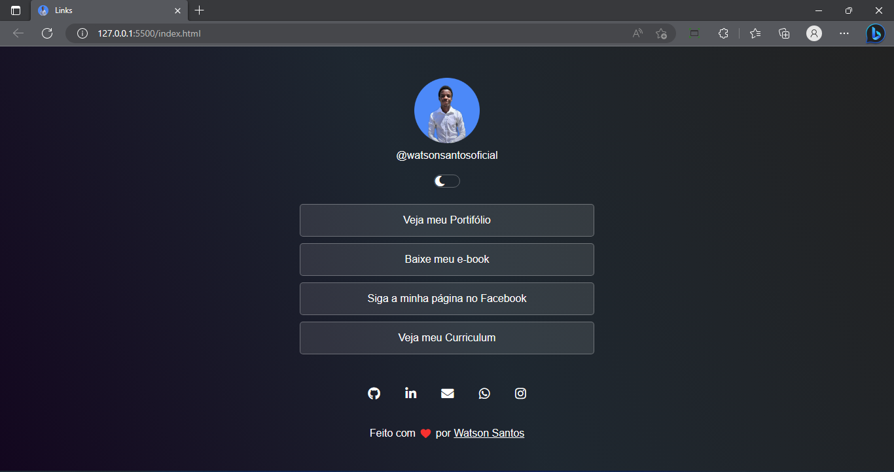

 

 
 
 
 
 
 
 

 

<h1 align=center><i>Dev Links<i></h1>

## 💻 Sobre o projeto

🚀 Um projecto feito por meio de um desafio proposto pela <a href="rocketseat.com.br">Rocketeseat</a>

 

 <a href="#-sobre-o-projeto">Sobre</a> •
 <a href="#-funcionalidades">Funcionalidades</a> •
 <a href="#-demonstração">Demonstração</a> • 
 <a href="#-pré-requisitos">Pré-requisitos</a> • 
 <a href="#-tecnologias">Tecnologias</a> • 
 <a href="#-autor">Autor</a> • 
 <a href="#-licença">Licença</a>

 
<h4 align="center"> 
	🚩   Status:  Terminado!🚀   🚩
</h4>

## ⚙️ Funcionalidades

- ✅ Listagem de links do meu portifólio
- ✅ Listagem de links das minhas redes sociais
- ✅ Outros links importantes

## 📺 Demonstração

 

 

Link para teste: [Dev_links](https://watsonlinks.netlify.app/)

 

## 🔗 Pré-requisitos

Só precisas abrir o arquivo "index.html" e no caso de alguma alteração, podes utilizadr um editor de texto como por exemmlo: [VSCode](https://code.visualstudio.com/)

## 🛠 Tecnologias

As seguintes ferramentas foram usadas na construção do projeto:

- [HTML](https://html.com/)
- [CSS](https://nextjs.org/)
- [javaScript](https://html.com/)

## 👨‍💻 Autor

<a href="https://github.com/WatsonSantos">
 
  
 <b>Watson Santos</b></a> <a href="https://github.com/WatsonSantos" title="Watson Github">🚀</a>

Feito com ❤️ por Watson Santos 👋🏽 Entre em contato!

## 📝 Licença

Este projeto esta sobe a licença [MIT](./LICENSE).
